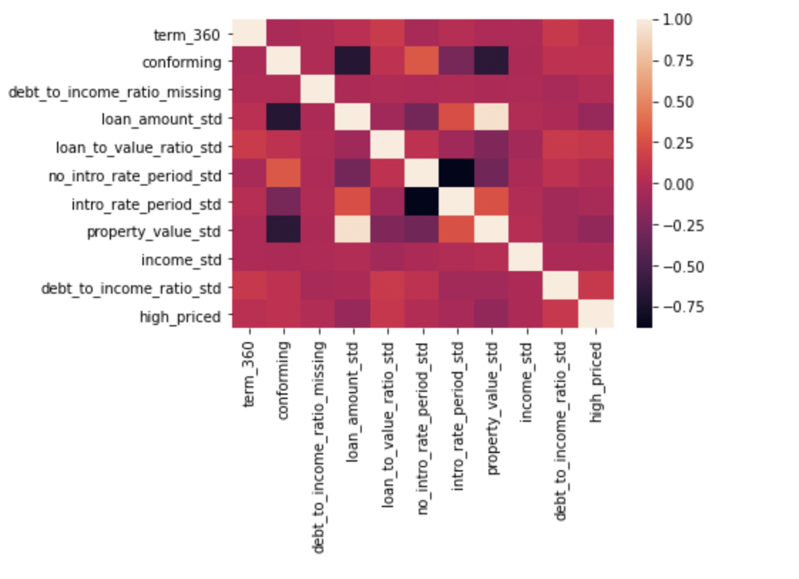
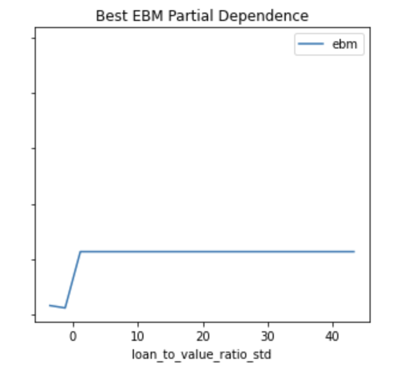
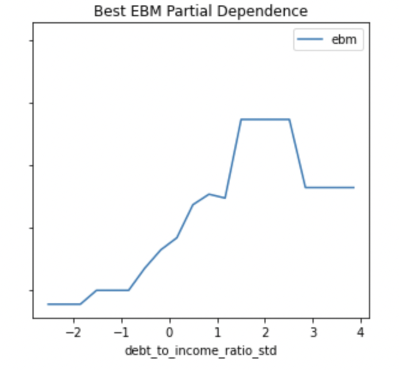
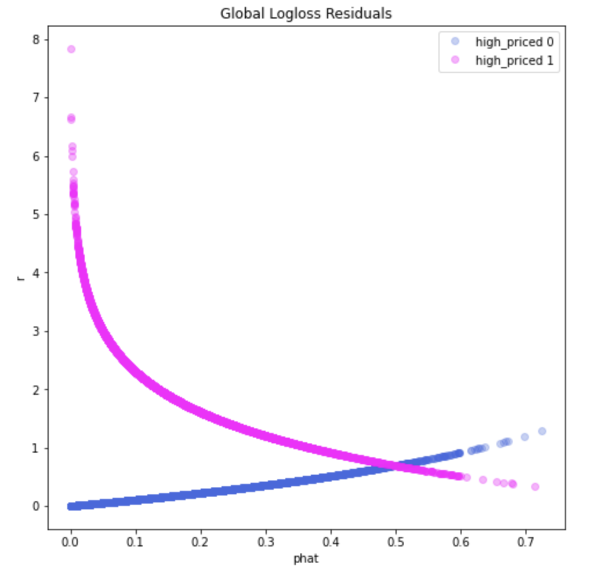

# Explainable-Machine-Learning

### Basic Information

Person or organization developing model: Harshit Aggarwal (haggarwal17@gwu.edu) and Harsharan Gorli ( harsharankaur@gwu.edu) 

Model date: June, 2022

Model version: 1.0

License: MIT

### Intended Use

* Primary intended uses: To predict whether or not the annual percentage rate (APR) for a mortgage is 150 basis points (1.5%) or more above a survey-based estoamte of similar mortgages
* Primary intended users: This is an example model and not deployment ready meant for students
* Out-of-scope use cases: Any use beyond an educational example is out-of-scope    
* Business value: As this model has been developed for academic purposes it should not be applied or used in real life. 
* Usage: This model should be only used for learning or reviewing purposes to create explainable models to avoid biases.

### Training Data

| Name | Modeling Role | Measurement Level | Description |
| ---- | ------------- | ----------------- | ----------- |
| conforming | Input | Binary int | whether the mortgage conforms to normal standards (1), or whether the loan is different (0)|
| debt_to_income_ratio_std | input | int | standardized debt-to-income ratio for mortgage applicants|
| debt_to_income_ratio_missing | input | Binary int | missing marker (1) for debt to income ratio std|
| income_std | input | int | standardized income for mortgage applicants|
| loan_amount_std | input | int | standardized amount of the mortgage for applicants|
| intro_rate_period_std | input | int | standardized introductory rate period for mortgage applicants|
| loan_to_value_ratio_std | input | int | ratio of the mortgage size to the value of the property for mortgage applicants|
| no_intro_rate_period_std| input | Binary int | whether or not a mortgage does not include an introductory rate period |
| property_value_std | input | int | value of the mortgaged property|
| term_360 | input | int | whether the mortgage is a standard 360 month mortgage (1) or a different type of mortgage (0)|
| high_priced | target/output | Binary int | whether (1) or not (0) the annual percentage rate (APR) charged for a mortgage is 150 basis points (1.5%) or more above a survey-based estimate of similar mortgages|
| row_id | ID | int |  unique row identifier |
| male | demographic information | int | whether a person identifies as male (1) or not male (0)|
| female | demographic information | int | whether a person identifies as female (1) or not female (0)|
| black | demographic information | int | whether a person identifies as black (1) or not black (0)|
| asian | demographic information | int | whether a person identifies as asian (1) or not asian (0)|
| white | demographic information | int | whether a person identifies as white (1) or not white (0)|
| amind | demographic information | int | whether a person identifies as amind (1) or not amind (0)|
| hipac | demographic information | int | whether a person identifies as hipac (1) or not hipac (0)|
| hispanic | demographic information | int | whether a person identifies as hispanic (1) or not hispanic (0)|
| non_hispanic | demographic information | int | whether a person identifies as non_hispanic (1) or not non_hispanic (0)|
| agegte62 | demographic information | int | whether a person is over the age of 62 (1) or not over the age of 62 (0)|
| agelt62E | demographic information | int | whether a person is below the age of 62 (1) or not below the age of 62 (0)|

Source of training data: https://github.com/jphall663/GWU_rml/tree/master/assignments/data

How training data was divided into training and validation data: 

* 70% training data  
* 30% validation data

Number of rows in training and validation data: 

* Training data: 112253 rows
* Validation data: 48085 rows

Engineered Columns:

None

### Evaluation Data

Source of evaluation data: https://github.com/jphall663/GWU_rml/tree/master/assignments/data

Number of rows in test data:
    
    19830 rows
    
Differences between training and test data:

All columns are the same except for the target column 

### Model Details

Columns used as inputs in the final model: conforming, debt_to_income_std, debt_to_income_ratio_missing, income_std, loan_amount_std, intro_rate_period_std, loan_to_value_ratio_std, no_intro_rate_period_std, property_value_std, term_360

Columns used as outputs in the final model: high_priced

Type of model: Explainable Boosting Machine (EBM)

Software and versions used: Python 3.6, Interpret ML v0.2.5

Hyperparameters:
* 'max_bins': 512
* 'max_interaction_bins': 32
* 'interactions': 15
* 'outer_bags': 10 
* 'inner_bags': 4
* 'learning_rate': 0.01
* 'validation_size': 0.4
* 'min_samples_leaf': 1
* 'max_leaves': 3
* 'early_stopping_rounds': 100.0,
* 'n_jobs': 4
* 'random_state': 12345

Other models considered:

Monotonic XGBoost: Test AUC - 0.813
Generalized Linear Regression Model: Test AUC - 0.775
GAMI-Net: Test AUC - 0.79
Rectified Linear Unit Deep Neural Network (ReLU-DNN): Test AUC - 0.814
Although some other models perform better they fail the Adverse-Impact Ratio test and hence were not considered as the best deployable model.

### Quantative Analysis

*EBM is the best model when compared to alternative models such as the penalized general linear model (GLM) and monotonic gradient boosting machine (MGBM) model, because it ranked highest on average across metrics and folds.The metrics used to evaluate the EBM model against alternative models is shown below:

**Corelation Heatmap:**

 **Feature Importance:** The best EBM feature importance plot shows global importance in EBM. 

**Local Feature Importance:** The best EBM feature importance plot shows local importance in EBM. 

 **Partial dependence:** The Top three features partially effect predicted variable high_priced in EBM are shown in the plots below.

**Adverse Impact Ratio:** 

| Compare v. Control            | Pre AIR   | Post AIR |
| ----------------------------- | ----- | ----- |
| Asian people vs. White people | 1.196 | 1.138 |
| Black people vs. White people | 0.740 | 0.819 |
| Females vs. Males             | 0.948 | 0.950 |
| AUC | 0.8249 | 0.7750 |

**Grid Search AIR vs AUC:** A two dimensional plot with x-axis as the AIR and y-axis as AUC, the result shows various options for accurate and less discriminatory models.

**Stolen Model:** A decision tree model that is used to craft a highly effective adversarial examples that allow the group to identify vulnerabilities.

**Variable Importance for Stolen Model:** The features that are important in the stolen Model are shown below.

**Residual Analysis:** Residuals Plot for removing outliers.

### Ethical Considerations 

Criterion: Different criterion chosen for building the same models may cause varied results and sensitive data should not be altered. Different geographic locations, different demographics etc can cause unexpected results and this model should not be applied beyond the scope of the training data.

Bias: Bias in Models leads to serious real life implications. Although the model has passed the Adverse-Impact-Ratio threshold of 0.8, there still exists biases and the model should be continually monitored for biases moving forward. These biases tend to impact minority groups and test data should be routinely monitored.

Data security issues: The data used should be kept secure and extremely confidential since any illegitimate use could cause information leakage issues.

Software issues: This model has been trained on the version of software listed above, attempts to recreate this with different versions might lead to unexpected changes or results.

Caveats and Recommendations: The training data is unbalanced, therefore unbalanced results might be obtained for different groups during evaluation.

All models are wrong, but some are useful - George E. P. Box
